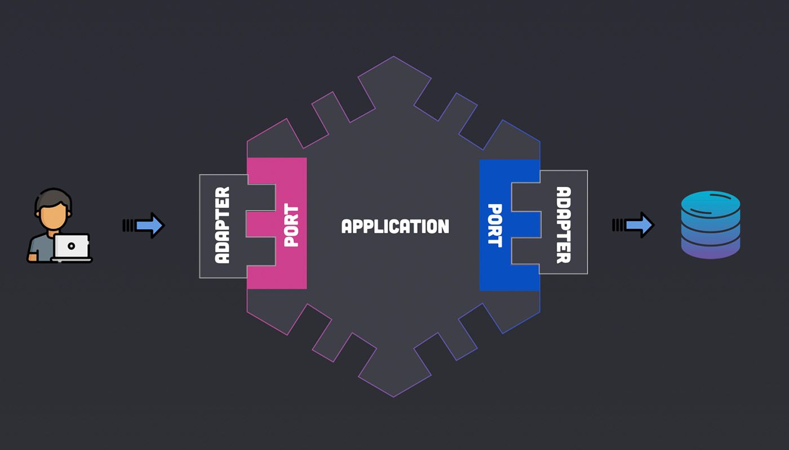

# SpringHexagonal - Ejemplo de Arquitectura Hexagonal

## Visión General

SpringHexagonal es una aplicación API REST desarrollada con Spring Boot y Java 17, que demuestra la implementación de la arquitectura hexagonal (también conocida como arquitectura de puertos y adaptadores). La aplicación está dockerizada, presenta una construcción Maven multimódulo y está diseñada para demostrar los principios del Domain-Driven Design (DDD) y los principios SOLID.

## Arquitectura

La arquitectura hexagonal en SpringHexagonal está diseñada para crear una aplicación con bajo acoplamiento que separa la lógica central de la aplicación (el dominio) de los servicios con los que interactúa (bases de datos, interfaz de usuario, aplicaciones externas, etc.).

## Capas

### Capa de Dominio
Esta capa es el corazón de la arquitectura hexagonal, encapsulando las reglas y procesos de negocio que son el propósito principal de la aplicación. Es aquí donde residen las entidades, objetos de valor, agregados, eventos de dominio y excepciones específicas del dominio, así como las interfaces de los puertos que definen los servicios requeridos del exterior (como persistencia o servicios externos), pero sin la implementación. Esta capa está estrictamente aislada de cualquier influencia externa, asegurando que la lógica de negocio sea pura y que no se vea afectada por cambios en otras capas o en la tecnología subyacente. La lógica de dominio es el motor que impulsa la aplicación y se mantiene coherente y valida a través de un enfoque de diseño centrado en el dominio (Domain-Driven Design - DDD)
### Capa de Aplicación
Actúa en el lado con el que el usuario o los programas externos interactuarán con la aplicación. Ahí está el código que permite estas interacciones. La aplicación controla el dominio. En esta capa se encuentra la lógica de aplicación que orquesta cómo se utiliza la lógica de negocio, traduciendo las solicitudes de los usuarios o sistemas externos en acciones dentro del dominio. Esta capa contiene adaptadores de entrada como REST controllers que aceptan y traducen las peticiones HTTP a llamadas al dominio a través de los puertos.
### Capa de Infraestructura
Es la parte donde encontramos las dependencias que necesita la aplicación para funcionar. Abarca todos los detalles técnicos necesarios para que la aplicación funcione, tales como la configuración de la base de datos y otros servicios externos. Los adaptadores de salida implementan los puertos definidos en el dominio para interactuar con estos sistemas externos.


## Puertos y Adaptadores

### Puertos
Los puertos en la arquitectura hexagonal son interfaces que separan la lógica de negocio del resto de la aplicación. Los puertos de entrada permiten a la aplicación recibir datos y solicitudes de actores externos, mientras que los puertos de salida habilitan la interacción de la aplicación con sistemas externos, como bases de datos o servicios web. Esta separación facilita la mantenibilidad y la escalabilidad, permitiendo adaptar o reemplazar componentes sin alterar el núcleo de la aplicación.
### Adaptadores
Implementan los puertos, adaptando el mundo externo al dominio y viceversa. Puede haber varios adaptadores para un solo puerto.  Los "adaptadores" en la arquitectura hexagonal pueden ser tanto de entrada como de salida (también conocidos como "driven" y "driving"). Los adaptadores de entrada se utilizan para interactuar con el núcleo de la aplicación desde el exterior (como una API REST), mientras que los adaptadores de salida se utilizan para que la aplicación interactúe con componentes externos.

## Beneficios

- **Flexibilidad**: Facilidad para reemplazar componentes y servicios sin cambiar la lógica del dominio.
- **Mantenibilidad**: La aplicación se vuelve más fácil de mantener debido a límites bien definidos.
- **Testabilidad**: Cada parte del sistema se puede probar de forma aislada.

## Alineación con SOLID y DDD

- **Principios SOLID**: La arquitectura respeta estos principios al separar preocupaciones y definir contratos claros (interfaces).
- **DDD**: El modelo de dominio es central, y todas las demás partes de la aplicación se construyen en torno a él.

## Requisitos del PC

- Java: Java Development Kit (JDK) versión 17.
- Maven: La última versión disponible es recomendada.
- Docker: Asegúrate de tener Docker y Docker Compose instalados. La última versión disponible es recomendada.
- Postman: La última versión disponible es recomendada.
- IDE: IntelliJ IDEA o Eclipse.
- DBeaver: La última versión disponible es recomendada.

## Despliegue

Para desplegar la aplicación localmente, sigue estos pasos:

1. **Clonar el Repositorio**:
    
    ```bash
    git clone https://github.com/agcadu/SpringHexagonal.git
    ```

2. **Dockerizar**:
   Asegúrate de que Docker esté instalado y funcionando en tu máquina. Navega al directorio raíz del proyecto y ejecuta:
    
    ```bash
    cd SpringHexagonal
    ```
    ```bash
    docker compose up
     ```

3. **Configuración de la Base de Datos**:
   La base de datos PostgreSQL se configurará automáticamente mediante Docker Compose utilizando las variables de entorno definidas en `docker-compose.yml`.
URL de la Base de Datos: `jdbc:postgresql://localhost:5432/PERSONS` User: `postgres` Password: `postgres`.

4. **Aplicación**:
   La aplicación Spring Boot se encuentra en el módulo boot, que es el punto de entrada de la aplicación.

5. **Pruebas**:
   Utiliza la colección de Postman proporcionada `SpringHexagonal.postman_collection.json` para probar los endpoints.

## Endpoints

- **Listar Personas**: `GET http://localhost:8080/v1/persons`
- **Buscar Persona por DNI**: `GET http://localhost:8080/v1/person/{DNI}`
- **Añadir Persona**: `POST http://localhost:8080/v1/person`
- **Actualizar Persona**: `PUT http://localhost:8080/v1/person/update`
- **Eliminar Persona**: `DELETE http://localhost:8080/v1/person/{DNI}`

---

